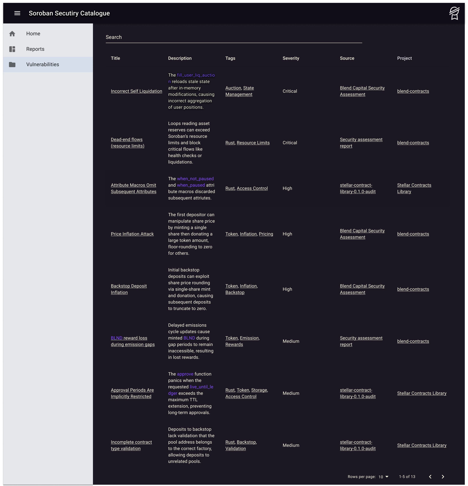
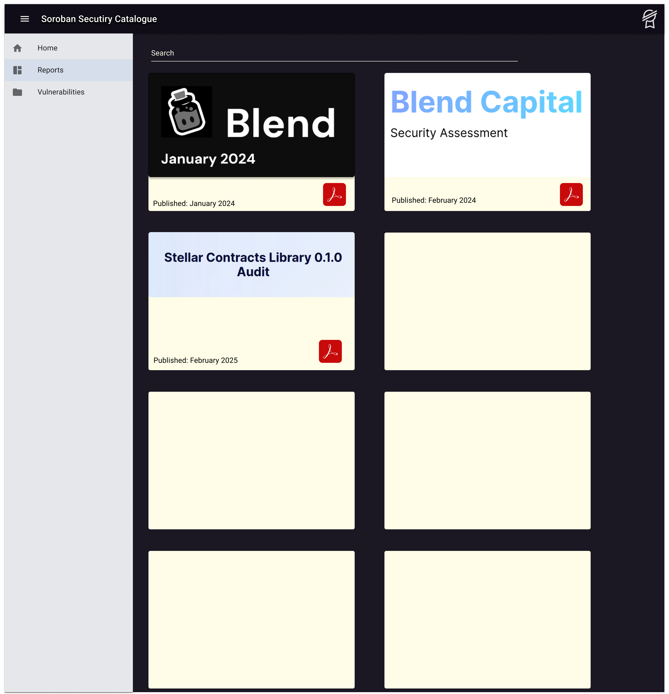
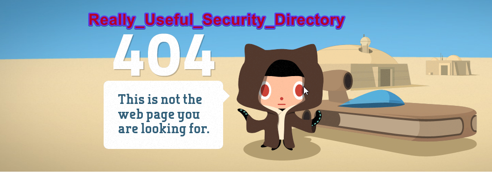
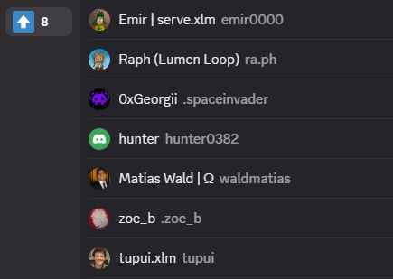

*Unified knowledge base of Soroban common vulnerabilities and best practices*

YouTube: [link](https://youtu.be/brnYC6PXzeA)

Stellar Developers Discord RFP: [link](https://discord.com/channels/897514728459468821/1373603762924556340)

## Description:

In order to attract new developers and security experts to Stellar, we need to provide them with familiar tools and information to start building with ease.
By providing a unified knowledge base of common vulnerabilities and best practices, developers can focus on building using Soroban safely.

## Products & Services: 

Soroban vulnerability information is fragmented across multiple channels. There is no unified, searchable, community-driven platform aggregating all Soroban vulnerability reports. Our team at Inferara will create a Soroban knowledge base with a web based user interface.

Here is an example of how information might be organized. 

Figma wireframes: [link](https://www.figma.com/design/GPSKWEoNu7aYnq8cUddhIz/Stellar-Soroban-Security-Catalogue?node-id=6036-164056&t=jDg6lj0OM4IUpWCo-1)

*Please keep in mind these are basic wireframes at this time*

## Product Features:

* Usable Information: Aggregate existing Soroban Security reports, audits and vulnerability data
  * Through advanced filtering & classification provide powerful search and filter capabilities.
  * Things such as: filter vulnerabilities by severity (Critical, High, Medium, Low), type/category (overflow, access control, logic bug, etc.), affected project or contract, date, and other criteria. 
  * Provide a nice and useful Web UI 

Each vulnerability entry is classified with metadata to support granular filtering and sorting.

* Organized Data: Provide advanced search, filtering, classificaiton by seveirty, type, project / platform origin and so on
  * Research is useless if you can't find an answer. We will collect, organize and maintain this information. 

* Knowledge Transfer: Encourage knowledge & best practices sharing between Stellar users, developers and experts
  * Once interest, usage and content of the knowledge base is refined we hope it will be THE link people share with new builders instead of a random collection of links that happen to be on the mind of the informer at the time. One direct starting point. 

* Moderated Community Submissions: Encourage community contributions of new findings or reports while ensuring data integrity through moderation
  * User account creation
  * Role system: Admins, contributors, moderators & viewers
 Community submissions and support is greatly encouraged. Due to security reasons we want to ensure that the reported data is accurate to maintain security for the Stellar ecosystem.

*We also understand the use of Stella in the Stellar Developers discord.*

If we are able to freely access the api of Stella we will further integrate it with the knowledge base.

Some of these additional features might include:

* Additional sources for Stella to utilize. While writing this submission Stella was helpful, but did not point us to many relevant *up-to-date* resources
* More accurate & defined descriptions to educate users with

To see how else this integration could be useful please check out our [Architecture](./Architecture.md) page for more detail and ideas.

We believe access to this knowledge and continuous knowledge transfer will create a succicnt starting point not just for new users; also a place for experts to return to and share their extensive knowledge without unneccesary obfuscation. It will highlight common vulnerability patterns and recommended mitigations, helping developers avoid known mistakes. Important data such as vulnerabilities, edge cases and uncommon errors should not require extensive time to discover. As information is currently fragmented across various channels, we hope this knowledge base will remove a lot of friction for existing developers, auditors and Stellar projects. 

## Services:

We want to prevent this from happening to Stellar developers:

* Continuity: We will maintain, host and monitor the Security Catalogue
* Report: As new security flaws, hacks or other issues occur we will highlight their impact
* Educate: Provide the resources necessary for existing & new developers on Stellar to avoid common vulnerabilities
* Moderate: In order to maintain data integrity we will ensure that future submissions & reports are accurate

### Traction Evidence: 
Being a rather new concept our traction is still building. We hope to bring more attention to this topic as more opportunities to disuss it arise. As we are building the Security Catalog for Soroban users, we hope to hear feedback from Stellar users in order to collaborate!

Here are some interested individuals on our post in the #ideas-rfp section of the Stellar Developers Discord

Our team has a strong foundation of experience and knowledge even outside the scope of this particular project. 

We will divert our attention from our current research of the [inference programming language]([url](https://github.com/Inferara/inference-language-spec)) to focus on this security knowledge base. 
Since verification driven programming is extremely niche and complex topic, we believe it's best to showcase our capabilities in a way that is easier understood first. That is why we are focusing first on tools & information that can be readily used by Stellar developers. That tool being this Security Catalogue.

Further user information is available upon request. 

### Technical Architecture: 
Can be viewed at [Architecture](./Architecture.md)

## SCF Build Tranche Deliverables

Below are our Milestone / Tranche Deliverables.

For a more precise look we highly urge you to read our [Architecture](./Architecture.md) page.

| Milestone | Brief Description | Measure of Completion | Estimated Delivery Date | Allocatied Budget (USD) |
| --- | -- | -- | -- | -- |
|Pichu| Initial version is deployed and available online. | Catalogue is available via the public domain. The basic UI is implemented. First issues and reports are available for searching and viewing.  | 14 July 2025 | 20,000 |
|Pikachu| Users can sign up + semantic search. | Users can create accounts. Semantic search over catalogue is available. More vulnarabilities and reports are available. | 18 August 2025 | 12,095 |
|Raichu| Moderator role + issues/report submition available | Add a new role: "Moderator". Users can submit issues and reports. Moderators can approve those. After approval, issues appear in the catalogue and available as usual. | 15 September 2025 | 12,095 |

### Budget: 
| Milestone | Brief Description | Measure of Completion | Estimated Delivery Date | Allocatied Budget (USD) |
| --- | -- | -- | -- | -- |
|Pichu| Initial version is deployed and available online. | Catalogue is available via the public domain. The basic UI is implemented. First issues and reports are available for searching and viewing.  | 14 July 2025 | 20,000 |
|Pikachu| Users can sign up + semantic search. | Users can create accounts. Semantic search over catalogue is available. More vulnarabilities and reports are available. | 18 August 2025 | 12,095 |
|Raichu| Moderator role + issues/report submition available | Add a new role: "Moderator". Users can submit issues and reports. Moderators can approve those. After approval, issues appear in the catalogue and available as usual. | 15 September 2025 | 12,095 |

### Go-To-Market Plan:

Our go-to-market plan is a bit different than traditional products and services on Soroban. This type of development tooling is focusing specificially on curating data, educating users and engaging with the community to use it.

The main 2 users are individual developers & auditors. Both of these include experts to Soroban as well as newer users.

The experts can stay aware of existing & future vulnerabilities, whereas the newer developers can benefit from a well documented set of resources to start their development journey using Soroban.

Though individual use cases for the Security Catalog can vary greatly, we have identified some key ways we will reach users.

For developers:

- Direct access to the knowledge base
- Inform developers via Stellar developer discord, webinars & in person events
- Participate in Stellar developer meetings
- Provide existing documentation support & maintenance for Inference
- Create educational content to showcase how to **apply** the informaiton in the security catalog (Videos, articles etc.)
- Further engage with the community through discord & other relevant channels

For Auditors:

- Similar actions as above, simply curated to auditors
- Provide ecosystem reports of common issues we discover in order to educate potential users & existing auditors

For Others:

-Get them to help spread the word :) 

### Success Criteria: 

We have divided success criteria into these categories: 

1. Ecosystem Security
2. Tool usage & Awareness
3. Community Engagement

## Ecosystem Security-

By providing access to security reports, common issues and vulnerabilties in a **unified**, organized manner, it will be be a tremendous resource for the Soroban developer community. It will be a direct place to point to for maintaining Stellar security. By flagging and understanding potential issues, we can secure Stellar even further.

## Tool usage & Awareness -

Having developers using and sharing content from the knowledge base will be important.
We can also observe the amount of registered accounts & website visits.

## Community Engagement

Receiving valuable feedback from developers, users and Stellar projects is crucial.
We want to build a tool that will be used, improved and help prevent critical errors, not another impractical site that goes unused.

Thanks for taking the time to read our proposal!

## LICENSE

[Apache License 2.0](./LICENSE)

